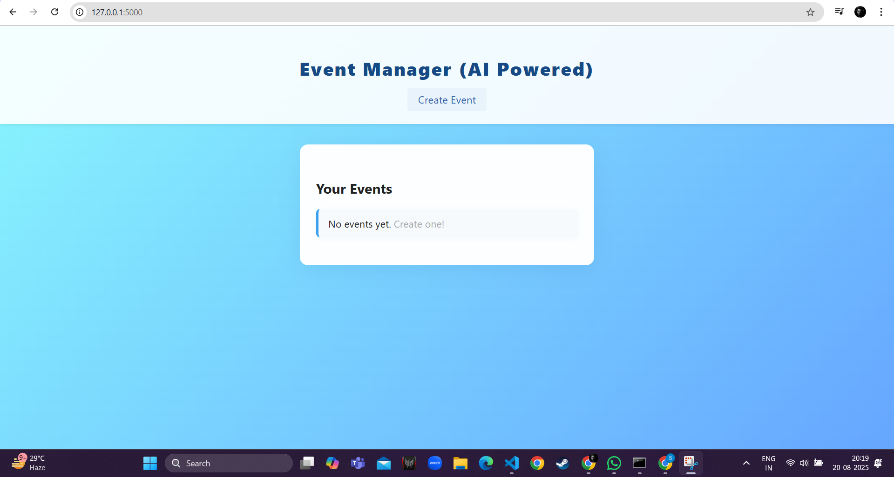

# 🚀 Event Manager (AI-Powered)

A **Flask-based AI-powered event management system** that helps users create, edit, delete, and view events.  
It also generates **smart promotional messages** for each event automatically to make sharing easier.  

---

## ❓ Problem Statement
Managing events often becomes messy — people forget dates, details, or struggle to promote their events effectively.  
Traditional event managers only store event information but do not help in **event promotion**.  

This project addresses the problem by not only storing and managing event details but also **auto-generating promotional content** to attract participants.

---

## ✅ Current Progress Status
- ✔️ Event creation, editing, deletion, and viewing functionality is complete.  
- ✔️ AI-powered promotional message generator implemented.  
- ✔️ Clean and responsive frontend UI with CSS styling.  
- ⏳ Database integration (currently using in-memory storage).  
- ⏳ Deployment to cloud/production.  

**Overall Progress:** ~70% complete.  

---

## 💡 How the Prototype Solves the Problem
- Provides a **simple web-based interface** for managing all events in one place.  
- Auto-generates **AI promotional text** for each event to save time and effort.  
- Reduces manual work by making events **easily editable and deletable**.  
- Gives users a **modern, minimal UI** to keep things professional and clean.  

---

## 🛠️ Technologies & Tools Used
- **Backend:** Python, Flask  
- **Frontend:** HTML, CSS (Jinja2 templates)  
- **AI Logic:** Simple Python function generating promotional text  
- **Storage:** In-memory (list) — can be extended with SQL/NoSQL DB  
- **Others:** Jinja templating, Flask routing  

---

## 📸 Screenshots

### 🏠 Homepage

### ➕ Creating an Event
)

### 📄 Event Created
)

### ✏️ Updation & Deletion
)

---
